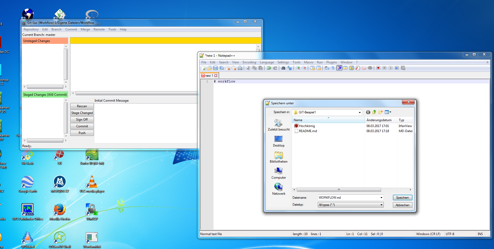
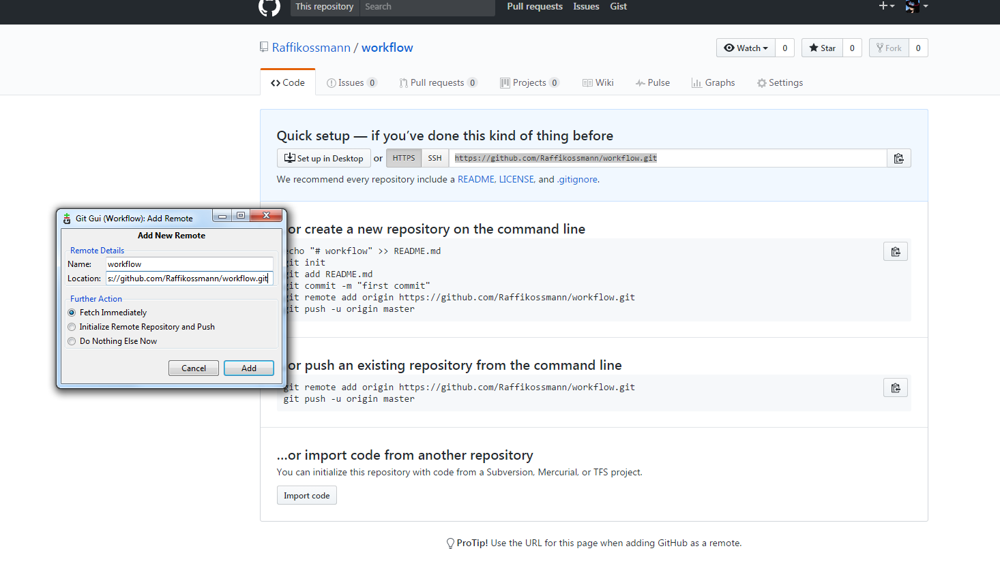

# workflow

1. Programm Git Gui öffnen und eine local repository anlegen
 
1. workflow. md hinzufügen zum lokalen repository
1. Erstellen eines repository bei Github und Link bei Git Gui einfügen
 
1. bei workflow.md File rescan, stage, sign off, commit und push durchführen -> erscheint auf Github